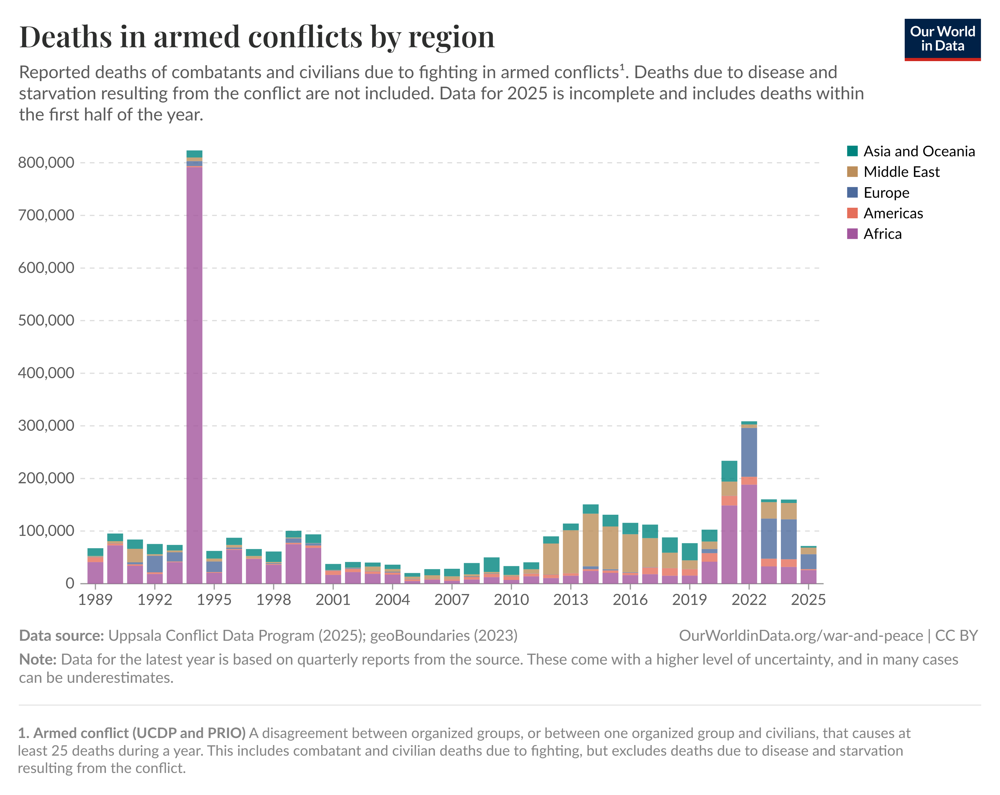
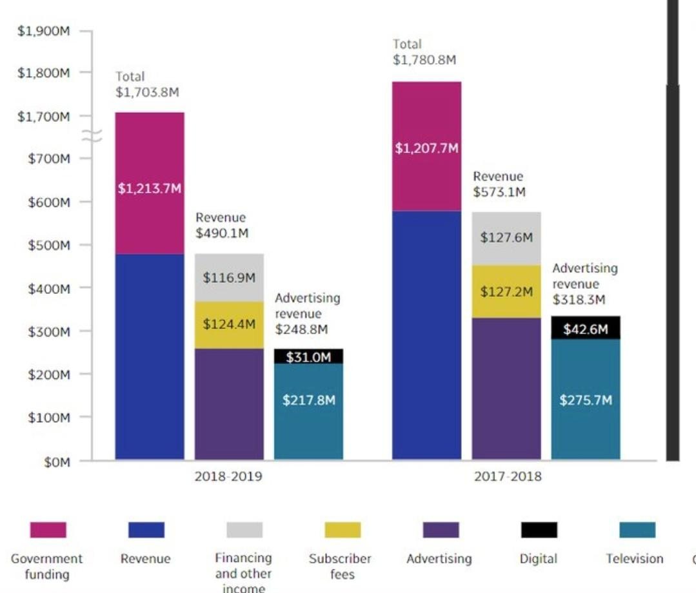

```{r setup, include=FALSE}
## **DO NOT EDIT THIS CODE CHUNK**
knitr::opts_chunk$set(echo = TRUE)
library(tidyverse)
```

```{r}
strava_runs <- read_csv("data/strava_runs.csv")
```

```{r}
data_5k_10k <- strava_runs %>%
  mutate(
    event = case_when(
      distance..m. > 4998 & distance..m. < 5015  ~ "5k",
      distance..m. > 9998 & distance..m. < 10015 ~ "10k",
      TRUE ~ NA_character_
    )
  ) %>%
  filter(!is.na(event))
```


## Exercise 1

```{r ex1a, out.width="80%"}
data_5k_10k %>% 
  filter(gender == "M") %>%
  filter(!is.na(average.heart.rate..bpm.)) %>%
  ggplot(aes(x = average.heart.rate..bpm.)) + 
  geom_histogram(bins = 20)

male_summary <- data_5k_10k %>%
  filter(gender == "M") %>%
  filter(!is.na(average.heart.rate..bpm.)) %>%
  summarise(
    Mean = mean(average.heart.rate..bpm.),
    Median = median(average.heart.rate..bpm.),
    SD = sd(average.heart.rate..bpm.),
    Min = min(average.heart.rate..bpm.),
    Max = max(average.heart.rate..bpm.),
    Length = length(average.heart.rate..bpm.)
  )
male_summary
```

(a)
The histogram for male runners’ average heart rate shows a roughly unimodal and slightly right-skewed distribution, with most runners’ heart rates concentrated between 140–165 bpm.
The calculated summary statistics show: Mean ≈ 147.9444 bpm, Median ≈ 147.9 bpm, SD ≈ 17.2218 bpm,length =252
This suggests that most male runners maintain a moderate heart rate, with a few outliers who exhibit higher heart rates.


```{r ex1b, out.width="80%"}
# Write your code for Ex1b here

data_5k_10k %>% 
  filter(gender == "F") %>%
  filter(!is.na(average.heart.rate..bpm.)) %>%
  ggplot(aes(x = average.heart.rate..bpm.)) + 
  geom_histogram(bins = 20)

female_summary <- data_5k_10k %>%
  filter(gender == "F") %>%
  filter(!is.na(average.heart.rate..bpm.)) %>%
  summarise(
    Mean = mean(average.heart.rate..bpm.),
    Median = median(average.heart.rate..bpm.),
    SD = sd(average.heart.rate..bpm.),
    Min = min(average.heart.rate..bpm.),
    Max = max(average.heart.rate..bpm.),
    Length = length(average.heart.rate..bpm.)
  )
female_summary


```


(b)
The histogram for female runners'average heart rate shows bimodal distribution, which focus around 150–170 bpm.
The summary statistics indicate:Mean ≈ 155.6829 bpm， Median ≈ 156.7 bpm， SD ≈ 13.2207 bpm， length=76
Comparing with male runners, female runners generally show higher average heart rates. In addition, female runners have a smaller standard deviation than male runners, which indicated that their average heart rates are more consistent.However,the smaller SD among female runners could be related to the their smaller length, which could make the distribution appear more consistent.

## Exercise 2

```{r ex2, out.width = "80%"}
# Write your code to answer exercise 2a here


```

_Write your text to answer exercise 2b here (Please delete this message before submission!)_


## Exercise 3

```{r ex3, out.width = "80%"}
# Write your code to answer exercise 3 here


```


## Exercise 4

#### Example of a good data visualisation

```{r ex4_good_viz, echo = FALSE, out.width = "80%"}
# edit the file path accordingly

```

_Edit the text below by replacing the bold text with the appropriate information to provide a reference for your image (Please delete this message before submission!)_

**Author/Organisation**, "**Title of website**" [Online]. Available at: **URL** (Accessed: **day month year**)


The above image presents a good data visualisation because:

-   _Reason 1_
-   _Reason 2_


#### Example of a bad data visualisation


```{r ex4_bad_viz, echo = FALSE, out.width = "80%"}
# edit the file path accordingly

```

_Edit the text below by replacing the bold text with the appropriate information to provide a reference for your image (Please delete this message before submission!)_

**Author/Organisation**, "**Title of website**" [Online]. Available at: **URL** (Accessed: **day month year**)


The above image presents a bad data visualisation because:

-   _Reason 1_
-   _Reason 2_


